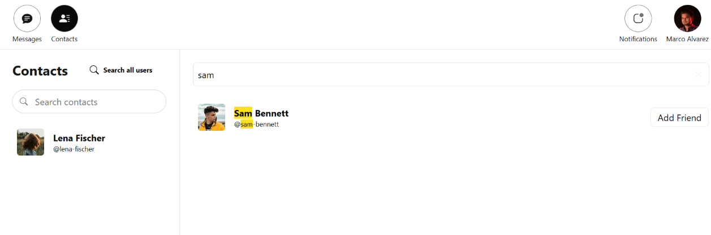
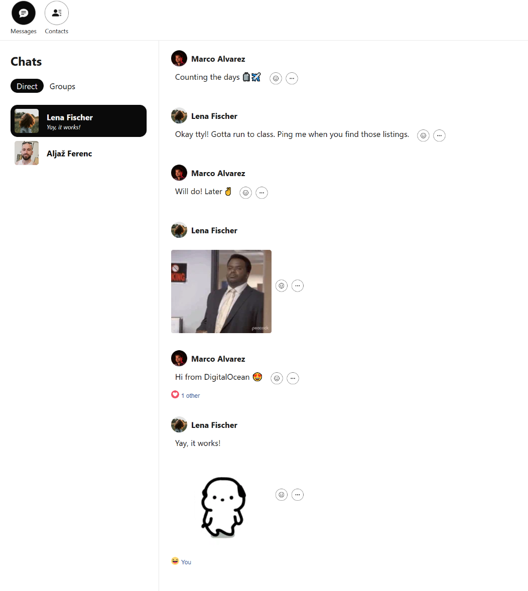
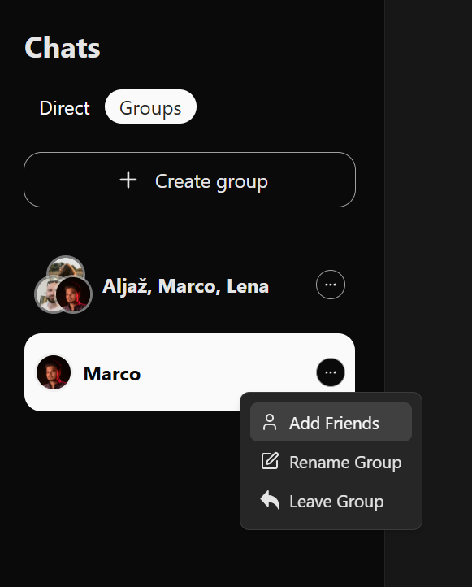
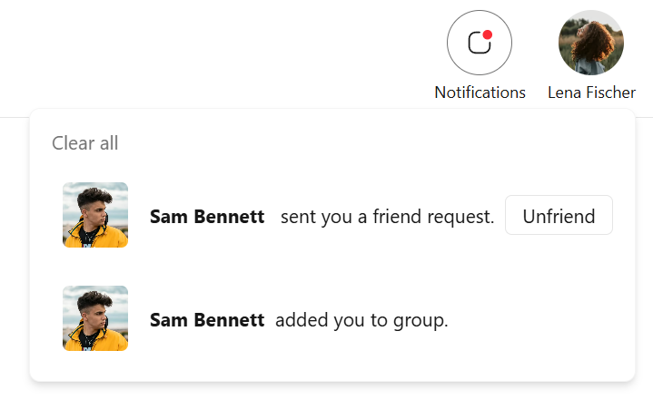
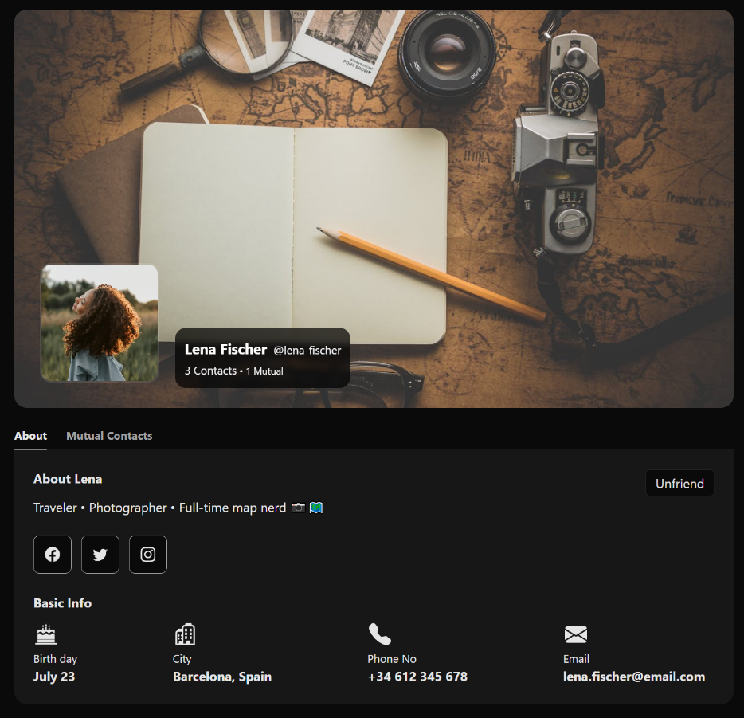
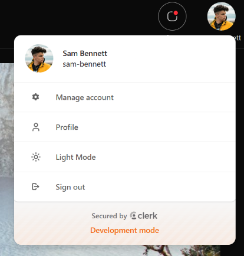

# Chat

## Your chat, your way, real-time.

Chat is a real-time messaging app, where users can share messages, images, gifs, files, create groups and more.
## Tech Stack
**Backend**: Express, Clerk, DigitalOcean

**Frontend**: React, socket.io, Giphy, React Query, Zustand

**Database**: MongoDB, AppWrite

## How to Use the App
### **Sign up**:
- Create an account with your email.

### Find Users
In the top left corner navigate to `Contacts` and search for a user you want to connect with.

Clicking on a user will open their profile.

After clicking `Add Friend`, the user will get a notification and be added to the `Pending Users` list until they accept your request.

Once accepted, the user will be added to your contacts, and you can start chatting.

### Direct Messaging

Go to `Messages` and select the user you want to chat with.

You can send text messages, images, files, and GIFs. You can also reply to specific messages and add reactions.

### Groups
To create a group chat with multiple friends, go to `Groups` in the `Chats` section and click `Create Group`.

You’ll automatically be added as the first member. From there, you can invite friends.

Invited friends will receive a notification.

Any member can rename the group or leave the chat. When this happens, the group will see a notification.

### Notifications
You’ll receive a notification whenever someone sends you a friend request or adds you to a group. Notifications appear next to your profile picture.

### User Profiles
Clicking a user’s profile picture in `Contacts` takes you to their profile page, where you can see their shared information and your mutual friends.

### Account Management
Click your own profile picture to open the menu provided by Clerk, where you can:
- manage your account - update your email, username, change password and delete account.
- update your profile info 
- switch between light and dark mode
- sign out

## Try It Out
[Live Page](https://af-chat-fe.netlify.app/)

To test the app, you can either:
- use the demo email and password provided on the sign-in page.
- or create your own account.